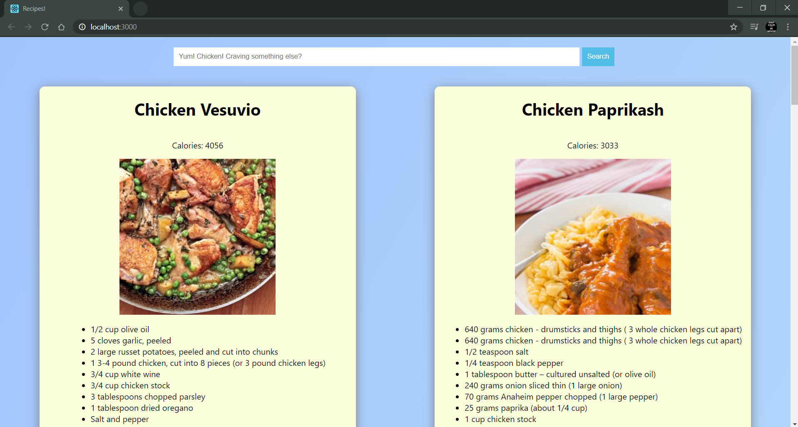
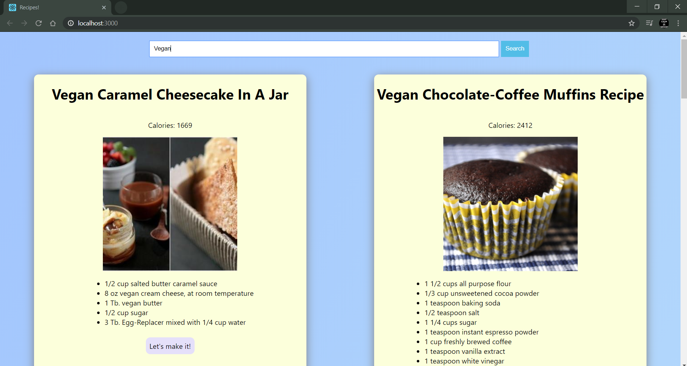
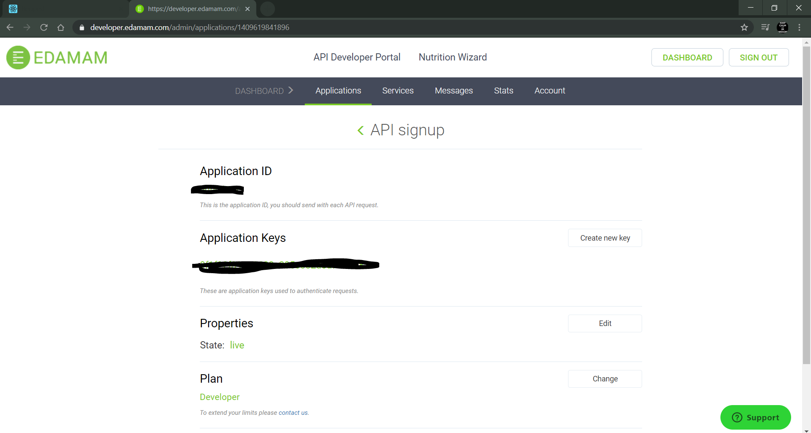

## Recipe-App

This project uses an API from EDAMAM to fetch the recipes. I have removed the API id and key as they require premium membership to be used by others. Thus, you'll need to get an id and key of your own. Don't worry, it takes just a minute.

This project was bootstrapped with [Create React App](https://github.com/facebook/create-react-app). If you'd like a tutorial on how to make a similar app then follow DevEd's [video](https://www.youtube.com/watch?v=U9T6YkEDkMo). 

###  `API ID and Key`

1. Go to https://developer.edamam.com/edamam-recipe-api
2. Sign up and use the free developer recipe search api
3. Copy the id and key to the app.js file in ./src

### `npm start`

Runs the app in the development mode. 
Open [http://localhost:3000](http://localhost:3000) to view it in the browser.

The page will reload if you make edits. 
You will also see any lint errors in the console.

